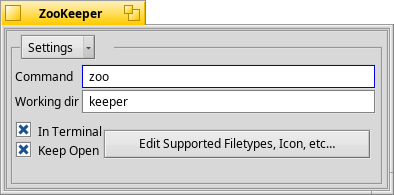

# ZooKeeper

###  by Jonas Sundstrom

#### copyleft 2004, 2005, Public Domain

ZooKeeper is a glue application (or frontend) that lets you 
specify a shell command or script to be executed on a set
of files.
	
It's designed to be cloned and customized.

### How to Install
Simply run `make`, and copy the app ZooKeeper into `~/config/non-packaged/add-ons/Tracker`.

### Additional Information
When launched without any arguments or files ZooKeeper
provides a window where you add a shell command, a 
working directory, and other preferences. These settings
are stored with the executable making it possible to keep
multiple copies of ZooKeeper for different purposes.
	
Ways to use ZooKeeper:
* Filedrops on a ZooKeeper window
* Filedrops on a ZooKeeper icon
* Using Tracker's Open With... menu
* As the Preferred Application of a filetype
* As Tracker add-ons
	
If you want ZooKeeper to do anything useful at all you 
need to supply a shell command, including the $zkfiles
variable which will be substituted by the set of files 
given to ZooKeeper by any of its launch mechanisms.

There's no need to add extra quotation marks around 
$zkfiles and $zkfolder. ZooKeeper does the quoting for you.

Example:
Dropping 'wow.ps' on a ZooKeeper 
where the command is set to
`~/config/non-packaged/bin/psviewer` $zkfiles
Your file 'wow.ps' will open in psviewer
	
As a Tracker add-on, ZooKeeper also provides the
$zkfolder variable, should you ever need it.

It's best to give each copy of ZooKeeper a unique name, 
describing its purpose, and a unique Application Signature,
to help yourself and Haiku tell them apart.

